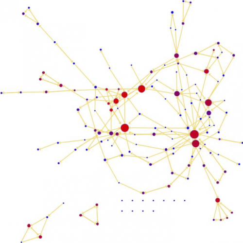

```{r setup, include=FALSE}
knitr::opts_chunk$set(cache=TRUE)
knitr::opts_chunk$set(echo = TRUE)
```

<br><br>

# Types of biological networks

Different types of information can be represented in the shape of networks in order to model the cell (Figure 10). The meaning of the nodes and edges used in a network representation depends on the type of data used to build the network and this should be taken into account when analysing it.


Figure: Types of biological interactions that can be represented by networks).

Different types of data will also produce different general network characteristics in terms of connectivity, complexity and structure, where edges and nodes potentially convey multiple layers of information.

Some of the most common types of biological networks are:

1. Protein-protein interaction networks

2. Metabolic networks

3. Genetic interaction networks

4. Gene / transcriptional regulatory networks

5. Cell signalling networks

<br><br>

# The sources of data underlying biological networks

It is important to emphasise that significant challenges arise not only from the sheer size of the dataset used, but also due to the fact that biological datasets are inherently noisy and incomplete. Often, different types of evidence will not overlap or will be contradictory. The way the data was obtained is an important aspect to considere here, with the information typically coming from the following sources:

**Manual curation of scientific literature**: Scientific curators or domain experts evaluate existing published evidence and store it in a database. This provides high-quality, well represented information, but curation is an expensive and time consuming task and the size of the datasets is limited by these factors.

**High-throughput datasets**: Some experimental approaches can generate large amounts of data, such as large-scale PPI datasets generated via yeast two-hybrid or affinity purification plus mass spectrometry identification. They provide large, systematically produced datasets but the information suffers the inherent biases of the chosen technique and they vary in quality.

**Computational predictions**: Many methods use existing experimental evidence as their basis and aim to predict unexplored relationships between biological entities. For example, protein interactions in humans can be used to predict a similar interactions in mice if there are close enough orthologues in this organism. They provide a tool to broaden and even refine the space of experimentally derived interactions, but the datasets produced are understandably noisier than with the previous sources.

**Literature text-mining**: Multiple algorithms are used to computationally extract systematically represented relationships from the published literature. As with the previous case, although they can greatly increase the coverage of the data, natural language processing is a tricky business and the results tend to be rather noisy.

<br><br>

# Protein-protein interaction networks

**Protein-protein interactions (PPIs)** are essential to almost every process in a cell, so understanding PPIs is crucial for understanding cell physiology in normal and disease states. It is also essential in drug development, since drugs can affect PPIs. Protein-protein interaction networks (PPIN) are mathematical representations of the physical contacts between proteins in the cell. 

These contacts:

* are specific;
* occur between defined binding regions in the proteins; and
* have a particular biological meaning (i.e., they serve a specific function).

PPI information can represent both transient and stable interactions:

* Stable interactions are formed in protein complexes (e.g. ribosome, haemoglobin).
* Transient interactions are brief interactions that modify or carry a protein, leading to further change (e.g. protein kinases, nuclear pore importins). They constitute the most dynamic part of the interactome.

Knowledge of PPIs can be used to:

* assign putative roles to uncharacterised proteins; 
* add fine-grained detail about the steps within a signalling pathway; or 
* characterise the relationships between proteins that form multi-molecular complexes such as the proteasome.

<br><br>

# The interactome

The interactome is the totality of PPIs that happen in a cell, an organism or a specific biological context. The development of large-scale PPI screening techniques, especially high-throughput affinity purification combined with mass-spectrometry and the yeast two-hybrid assay, has caused an explosion in the amount of PPI data and the construction of ever more complex and complete interactomes (Figure 16). This experimental evidence is complemented by the availability of PPI prediction algorithms. A lot of this information is available through molecular interaction databases such as **IntAct**.


Figure: Yeast (left) and human (right) interactomes obtained using the yeast-two hybrid method. Images reprinted by permission from Macmillan Publishers Ltd: Jeong et al. Nature 2001. 411 (3) and Rual et al. Nature 2005: 437 (4). 

It is important to emphasise once more the limitations of available PPI data. Our current knowledge of the interactome is both incomplete and noisy. PPI detection methods have limitations as to how many truly physiological interactions they can detect and they all find false positives and negatives

Next we will take a look at some of the properties of protein-protein interaction networks and the implications of these properties for biology.

<br><br>

# Properties of PPINs: small world effect

Protein-protein interaction networks show a small world effect meaning that there is great connectivity between proteins (Figure 17). In other words, it can be said that the network's diameter (the maximum number of steps separating any two nodes) is small, no matter how big the network is. This usually means that any two nodes are separated by less than six steps, more or less, reflecting the now widely popularised “six degrees of separation” theory used in social sciences.


Figure: The small world effect.

This level of connectivity has important biological consequences, since it allows for an efficient and quick flow of signals within the network. However, it also poses an interesting question: if the network is so tightly connected, why don't perturbations in a single gene or protein have dramatic consequences for the network?

Biological systems are extremely robust and can cope with a relatively high amount of perturbations in single genes/proteins. In order to explain how can this happen, we need to have a look at another fundamental property of PPINs: they are scale-free networks.

<br><br>

# Properties of PPINs: scale-free networks

Protein-protein interaction networks are scale-free networks (Figure 18A). The majority of nodes (proteins) in scale-free networks have only a few connections to other nodes, whereas some nodes (hubs) are connected to many other nodes in the network.


Figure: An example of a scale-free network (A). The typical degree distribution of a scale-free network (B).

The number of connections each node has is called its degree. If we represent the degree distribution of a scale-free network in a logarithmic scale, we can see how it fits with a line (they fit a power-law), having a small number of nodes with high degree (the hubs) and a large number of nodes with a low degree (Figure 18B). 

Scale-free networks can be built following the **preferential attachment model**, also known as the ‘rich get richer’ principle. This principle simply states that scale-free networks can be built by adding edges that are preferentially attached to those nodes with a highest degree (5). This building principle provides a self-organising mechanism for the generation and expansion of this type of network.

The scale-free nature of protein-protein interaction networks gives them a number of important features:


* Stability
  * If failures occur at random, and the vast majority of proteins are those with a small degree of connectivity, the likelihood that a hub would be affected is small.
  * If a hub-failure occurs, the network will generally not lose its connectedness, due to the remaining hubs.
* Invariant to changes of scale
  *  No matter how many nodes or edges the network has, its properties remain stable.
  * The presence of hubs is what allows for the small-world effect to be present regardless of the size of the network.
* Vulnerable to targeted attack
  * If we lose a few major hubs from the network, the network is turned into a set of rather isolated graphs.
  * Hubs are enriched with essential/lethal genes. For example, many cancer-linked proteins are hub proteins (e.g. the tumour suppressor protein p53). 

<font color = "red">It is important to note that, given the current limited coverage levels and variable quality of interaction data, the observed scale-free topology of existing protein-protein interaction networks cannot be confidently extrapolated to complete interactomes. In fact, some works have been questioning how well biological networks fit the scale-free power law distribution (6). </font>

<br><br>

# Properties of PPINs: transitivity

Another crucial characteristic of PPINs is their modularity. The transitivity or clustering coefficient of a network is a measure of the tendency of the nodes to cluster together. High transitivity means that the network contains communities or groups of nodes that are densely connected internally. Following an analogy from the social sciences, “the friends of my friends are my friends”. In biological networks, finding these communities is very important, because they can reflect functional modules and protein complexes (Figure 19).


Figure: Topological clusters reflecting biological function. Clusters are highlighted within dashed-line squares: I – Proteasomal machinery; II - translation-related protein cluster, containing several ribosomal proteins; III – energy production-related cluster, containing several mitochondrial ATPases. Image reproduced with permission of the authors of Hsia et al. Int J Mol Sci. 2015: 16..


A **module** is an exchangeable functional unit. They are self-contained components of a system with well-defined interfaces with other components. The defining feature of a module is that its intrinsic functional properties do not change when it is placed in a different context.  Modules help reduce the complexity of biological networks by giving us a set of reducible, functional units that can be studied as an integrated entity. Topological study of PPINs can help detect and define these modules.

**Protein complexes** can be considered a type of module in which proteins are interacting with each other in a stable manner, maintaining a more or less fixed configuration in time and space. They represent multi-protein machineries with specific functions. A broader type of functional module does not require the proteins to be stably bound to each other as long as its intrinsic functional properties do not change when placed in another context.

The study of modules is also useful when defining **intermodular interactions and proteins**. These are the edges/nodes that link different communities within a network. They can act as switches or high-level modulators that, for example, mediate cross-talk between different complexes or pathways.

We will talk more in detail about the search for modules in PPINs in a further section. Now let’s talk about the main strategies that can be used to analyse PPINs.

<br><br>

# Building and analysing PPINs
Now that we know a bit about graph theory and protein-protein interaction networks, we can look at the steps, strategies and tools used to build and analyse these networks (Figure).


Figure: A potential workflow for building and analysing protein-protein interaction networks.

First, we will briefly introduce various software packages or programmatic methods used to build and analyse networks. Next we talk about sources from which you can obtain PPI data and discuss several ways of analysing the data of which topological analysis of centralities and community-finding approaches are common strategies. Finally, we look at ways in which additional data can be added to understand the biological context of the network.

# Network representation and analysis tools

* Cytoscape
* Gephi

# Sources of PPI data

The first step in performing PPIN analysis is, of course, to build a network. There are different sources of PPI data (Figure 24) that can be used to do this and it is important to be aware of their advantages and disadvantages.

Essentially, you can obtain PPI data from:

* Your own experimental work, where you can choose how the data is represented and stored.
* A primary PPI database. These databases extract PPIs from the experimental evidence reported in the literature using a manual curation process. They are the primary providers of PPI data and they can represent a great deal of detail about interactions, depending on the database. 
* A metadatabase or a predictive database. These resources bring together the information provided by different primary databases and provide a unified representation of the data to the user. Predictive databases go beyond that and use the experimentally produced datasets to computationally predict interactions in unexplored areas of the interactome. Predictive databases provide a way of broadening or refining the space of experimentally derived interactions, but the datasets produced are noisier than those from other sources.


It will often be necessary to integrate PPI data from multiple sources as no database has a full representation of all the PPI evidence available. This creates some interesting challenges because different databases use different identifiers and contain different types of data.

In order to avoid redundancies and inconsistencies, it is important to understand the differences between the different databases in terms of:

i) The type of data and metadata they include. For example, some databases will give you only experimentally-derived data and others will also include predictions. Similarly, the level of detail given about the experimental setup varies between databases. 

ii) The identifiers used by the database. Different databases make different choices in this regard, so sometimes you may have to map different types of identifiers for data integration.

# Assessing reliability and measuring confidence

An important concern in network analysis is whether the interaction network can be trusted to represent a “real” biological interaction. Given the noise inherent in current interactome information, it is important to be stringent when evaluating the protein-protein interaction data we use in our analysis. It is important to take into account that interactome coverage is also incomplete and patchy, so we will not always have the luxury of filtering out less reliable evidence.

There are many different methods for ascertaining reliability and giving a measure of confidence. Some strategies make use of:

* Contextual biological information regarding the proteins or molecules involved in the interaction. For example, overlapping co-expression patterns (8, 9).
* Count how many times a given interaction has been reported in the literature, as a measure of experimental orthogonal validation. This is a popular and straightforward approach and there are more elaborate variations of this strategy, such as MIscore (see boxed text).
* Aggregated methods that use a number of different strategies and integrate them in a single score, such as INTscore (10).


## The MIscore method

MIscore is a method for assessing the reliability of protein-protein interaction data based on the use of standards (11). MIscore gives an estimation of confidence weighting on all available evidence for an interacting pair of proteins. The method allows weighting of evidence provided by different sources, provided the data is represented following the standards created by the IMEx consortium.

As shown in Figure 25, the method weights the:

* number of publications;
* detection method;
* interaction evidence type.

Different interaction detection methods and interaction types have different weights, assigned by a group of expert curators. These parameters are aggregated for each interacting pair and then normalised, giving a quantitative measure of how much experimental evidence there is behind a given interaction.


Figure 25 The MIscore normalised score calculates a composite score for an interaction based on the number of publications reporting the interaction, the reported interaction detection methods and interaction types. Reprinted from Villaveces et al. Merging and scoring molecular interactions utilising existing community standards: tools, use-cases and a case study. Database (Oxford), 2015 (11). By permission of Oxford University Press.

<br><br>

# Topological PPIN analysis
Analysing the topological features of a network is a useful way of identifying relevant participants and substructures that may be of biological significance. There are many different strategies that can be used to do this (Figure 26). In this section we focus on centrality analysis and topological clustering, although there are other strategies such as the search for shortest paths or motifs that are more often applied to networks with directionality and will not be covered here.


<br><br>

# Centrality analysis

Centrality gives an estimation on how important a node or edge is for the connectivity or the information flow of the network (Figure 27). It is a useful parameter in signalling networks and it is often used when trying to find drug targets.

Centrality analysis in PPINs usually aims to answer the following question:

Which protein is the most important and why?

Edge centrality can also be analysed, but this is less common and the concepts can easily be translated from the node-based centralities, so we will focus on the latter in this section.




Figure 27 Node centrality represented in a network. Bigger, redder nodes have higher centrality values in this representation. 

The definition of ‘central’ varies with the context or purpose of our analysis. Centrality can be measured using different metrics and criteria:

**Degree of the nodes**

* The degree of the nodes can be used as a rough estimate of centrality. As we saw earlier, nodes with a high degree (hubs) are key in maintaining some characteristics of scale-free networks such as their robustness and the small-world effect. However, this is a local measure since it does not take into account the rest of the network and the importance we give to its value depends strongly on the network's size.

**Global centrality measures**

* Global centrality measures take into account the whole of the network. They are relative measurements that provide a normalised value that is independent of network size. There are many different types of global centrality measures, each addressing a slightly different definition of centrality. Two of the most widely used global centrality measures are closeness and betweenness centralities, which we will address in more detail in the following sections.

**Other measures of centrality**

* More complex measures of centrality can be defined depending on the specific method used to calculate it. For example, centralities are often calculated using ‘random walks’ where random nodes are chosen as a starting point and the ‘time’ or ‘speed’ needed to reach other nodes in the network is calculated. This can be combined with the weights assigned to nodes or edges in the graph to influence the centrality calculation derived from other features. This is the method used by the Google PageRank algorithm to assign weight to each webpage (12).

Note that centrality parameters can also be calculated taking the directionality of edges into account which can cause slight changes their definitions. Since we are focusing on PPINs, we will consider edges to be undirected in this section.

<br><br>

# Closeness centrality


Closeness centrality is a useful measure that estimates how fast the flow of information would be through a given node to other nodes.

Closeness centrality measures how short the shortest paths are from node i to all nodes. It is usually expressed as the normalised inverse of the sum of the topological distances in the graph (see equation at the top of Figure 28). This sum is also known as the farness of the nodes. Sometimes closeness centrality is also expressed simply as the inverse the farness (13, 14). In the example shown on the bottom half of the figure, you can see the distances matrix for the graph on the left and the calculations to get the closeness centrality on the right. Node B is the most central node according to these parameters.


Figure 28 Calculating the closeness centrality of nodes in a graph.

<br><br>

# Betweenness centrality

Betweenness centrality is based on communication flow. Nodes with a high betweenness centrality are interesting because they lie on communication paths and can control information flow. These nodes can represent important proteins in signalling pathways and can form targets for drug discovery. By combining this data with interference analysis we can simulate targeted attacks on protein-protein interaction networks and predict which proteins are better drug candidates, for example see Yu, et al 2007 (15).

The calculation of betweenness centrality is not standardised and there are many ways solve it. It is basically defined as the number of shortest paths in the graph that pass through the node divided by the total number of shortest paths.

Betweenness centrality measures how often a node occurs on all shortest paths between two nodes. Hence, the betweenness of a node N is calculated considering couples of nodes (v1, v2) and counting the number of shortest paths linking those two nodes, which pass through node N. Next the value is related to the total number of shortest paths linking v1 and v2.


Figure 29 Betweenness centrality.

To give a more intuitive example, in the graph from Figure 29, either node B or node C can be removed and there will still be paths leading to node E. Node D, however, is quite central, since it is required for any path leading to node E. You can think of this graph as a city map and our analysis is telling us that D is the cross roads where traffic jams are more likely to occur. Betweenness centrality can in fact be used in city planning and there are studies aiming to optimise city transport based on this and related metrics (16).

<br><br>

# Clustering analysis
 
Looking for communities in a network is a nice strategy for reducing network complexity and extracting functional modules (e.g. protein complexes) that reflect the biology of the network. There are several terms that are commonly used when talking about clustering analysis (Figure 30):


Figure 30 Some concepts in network community analysis.  (Network communities figure from Wikimedia commons by j_ham3 and used under Creative Commons Attribution-Share Alike 3.0 Unported license. Haemoglobin 3D structure from PDBe and complex diagram from IntAct).

#### Community / Cluster 

A general, catch-all term that can be defined as a group of nodes that are more connected within themselves than with the rest of the network. The precise definition for a community will depend on the method or algorithm used to define it. When talking about PPINs, communities fall into two categories: functional modules and protein complexes.

#### Module 

In biology, modules are exchangeable functional units in which the nodes (proteins) do not have to be interacting in the same time or space. The most important characteristic of a module is that its intrinsic functional properties do not change when it is placed in a different context.

#### Complex 

A complex is a group of proteins that interact with each other at the same time and in the same space, forming relatively stable multi-protein machinery. You can use the Complex Portal to explore known macromolecular complexes in a number of model organisms.

#### Clique 

A subset of nodes in which every node is connected with every other member of the clique. A maximal clique is a clique that cannot be extended by adding an additional node not previously included in the clique. There are several different types of cliques and they can be used as the basis of algorithms that use topological criteria to look for communities.

#### Motif

Motifs are statistically over-represented sub-graphs in a network. They correspond with a pattern of connections that generates a characteristic dynamical response (e.g. a negative feedback loop). They are less important for the type of networks this tutorial is devoted to, but are quite useful in directed networks.

When exploring a PPIN for clusters, the goal is often to find functional modules or protein complexes that execute defined biological functions. There are many different methods that can help us find clusters and we will briefly introduce some of them in this section.

<br><br>

# Clustering analysis methods I
 
In this section we will focus on methods that exclusively use the topology of the network to find closely-connected components. This is generally known in graph theory as 'community detection methods'. No assumptions are made about the internal structure of these communities, we are just looking at high-density regions.

It is important to note that finding the best community structure is algorithmically extremely complex and is only possible for very small networks. For this reason, many approximation methods, often addressing different scenarios, have been developed. There are too many to cover in this course. Some examples include:

* Clique-percolation method
* Markov Clustering Algorithm (MCL)
* Fuzzy C-Means
* Affinity Propagation
* Chinese Whispers Clustering
* Label Propagation Clustering

We will briefly introduce two of the most popular methods used to analyse protein interaction networks: Newman-Girvan fast greedy algorithm and the MCODE algorithm.

Another way to address the search for communities within a network is to use a combination of the topology of the network and some external property, such as protein expression values, as an additional layer defining communities. A good example of this popular method is the jActiveModules app for Cytoscape (17). This app “[…] searches a molecular interaction network to find expression activated sub-networks. Such sub-networks are connected regions of a network that show significant changes in expression over particular subsets of conditions” (18). In essence, connected regions within a network with differential expression can be identified using this tool.

<br><br>

# Clustering analysis methods II
 

#### Newman-Girvan fast greedy algorithm

Developed for the study of networks in general, with a special focus on social and biological networks (19).

Identifies communities by using the edge betweenness centrality measure. Edges that connect different communities have higher centrality values, since a larger proportion of shortest paths will pass through them.

To define communities it uses the edge betweenness centrality scores to rank the edges of the network, then removes the most central edges and then re-calculates the betweenness scores until no edges are left. Edges affected by the removal are deemed to be part of the same community.
Can be considered a ‘naïve’ approach that will define communities even when they are only marginally more connected than the rest of the network.


Figure 31 Communities defined using Newman-Girvan and MCODE.

#### MCODE algorithm

Developed to find protein complexes in PPI networks (20).

Can be considered to be more stringent than the Newman-Girvan algorithm, since it aims to find only those sub networks that are very highly interconnected, representing relatively stable, multi-protein complexes that function as a single entity in time and space.

The parameters of the algorithm can be adjusted to make it less stringent, so that a looser definition of a community is used.

The algorithm uses a three-stage process:

1. Weighting: a higher score is given to those nodes whose neighbours are more interconnected.

2. Molecular complex prediction: starting with the highest-weighted node (seed), recursively move out, adding nodes to the complex that are above a given threshold.

3. Post-processing: applies filters to improve the cluster quality (haircut and fluff).

It is important to note that when we speak about ‘stringency’ we are talking about how interconnected the nodes within a sub-network must be in order to be considered a separate community. This changes depending on the biological question underlying the analysis. It is not the same to look for stable protein complexes, such as the proteasome, as it is to look for functional sub-modules representing a specific step in a signalling pathway.

<br><br>

# Annotation enrichment analysis

There are many different approaches that can be used to understand the biological context of protein-protein interaction networks. Annotation enrichment analysis is one of the most popular methods. Although it is not strictly speaking a network analysis tool, it is often used in combination with topological network analysis.

There are different varieties of this type of analysis, but in its most basic form, annotation enrichment analysis uses gene/protein annotations provided by knowledge-bases such as Gene Ontology (GO) or Reactome to infer which annotations are over-represented in a list of genes/proteins that can be taken from a network (Figure 32). Essentially, annotation tools perform some type of statistical test (usually a hypergeometric test, often also a binomial test) that tries to answer the following question:

"When sampling X proteins (test set) out of N proteins (reference set; graph or annotation), what is the probability that x, or more, of these proteins belong to a functional category C shared by n of the N proteins in the reference set." (21).

The result of this test provides us with a list of terms that describe the list/network, or rather a part of it, as a whole.


Figure 32 Annotation enrichment analysis using GO and Reactome in a network.

This type of analysis is most frequently performed using GO annotation as a reference, but tools such as the Cytoscape apps BiNGO and ClueGO can also manage other annotation databases such as Reactome and KEGG. This is a widely used technique that helps characterise the network as a whole or sub-sets of it, such as inter-connected communities found through topological clustering analysis.

More complex versions of this technique can factor in continuous variables such as expression fold change. The GSEA tool is a good example of a more advanced technique that makes use of similar basic concepts. A slightly old but very thorough overview of different tools of this family and the advantages and limitations of their different approaches can be found in Huang da et al 2009 (22).

<br><br>

# Limitations of annotation enrichment
 
#### Annotation
The main limitations of annotation enrichment come from the annotations themselves. Certain areas of biology are more thoroughly annotated and better described than others, with more detail and more accurate terms for well-known processes. For example, at the level of the proteins, more "popular" proteins are better annotated. This introduces a certain bias into the statistical analysis.

It is also important to note that GO terms can be assigned either by a human curator who performs careful, manual annotation or by computational approaches that use the basis of manual annotation to infer which terms would properly describe uncharted gene products. They use a number of different criteria that always refer to annotated gene products, such as sequence or structural similarity or phylogenetic closeness. The importance of the computationally derived annotations is quite significant, since they account for roughly 99% of the annotations that can be found in GO.

#### Simplifying the interpretation of annotation enrichment results

Another limitation of annotation enrichment is the complexity and detail of annotation associated with large gene or protein sets. This happens because resources such as Reactome and, especially, GO can be very complex and detailed in their annotation leading to the generation of overwhelmingly complicated networks of inter-related and similar terms. There are several ways to try and unravel this complexity.

The simplest approach is to use simplified ontologies. Many tools offer this option and use ontologies where fine detailed terms are removed and assigned to broader, more general parent terms. In GO, these simplified ontologies are called GOslims.

Other tools, such as the Cytoscape apps BiNGO or ClueGO, represent the results as a network of terms, where directed edges represent term relationships as defined in the ontology used. This allows tools from graph theory to be used to reorganise the layout of the network to uncover communities inside these terms networks which helps to simplify the output. BiNGO only provides the network view, so other tools are required to further simplify the analysis. ClueGO makes use of network analysis tools and Cohen's kappa coefficient to offer a simplified view of the results, grouping terms by similarity and offering much more interpretable results.

Finally, there are tools that are specifically devoted to simplifying the task of interpreting annotation enrichment results. The Cytoscape EnrichmentMap app is a very good example. It can use the output from some of the most popular annotation enrichment tools, such as DAVID, BiNGO, g:Profiler or the more sophisticated GSEA, and render it in the shape of clustered networks. The tool applies clustering and automatic layout techniques to overlap similar gene sets and provide a simplified representation of annotation enrichment results. It is especially useful when comparing results obtained from different sets, for example, those representing two different conditions.  

In summary, it is important to know the limitations of the annotation resource you are using to perform this type of analysis. It is also important to be aware of the inherent complexity of the results. Network analysis techniques can help simplify the interpretation of these results.

<br><br>

# Summary

#### Biological networks
Network biology makes use of the tools provided by graph theory to represent and analyse complex biological systems.

There are several types of biological networks: genetic, metabolic, cell signalling etc. This course focuses on protein-protein interaction networks (PPINs), but the concepts and tools presented can be used in other networks too.

Networks are represented by nodes and edges. Nodes represent different entities (e.g. genes or proteins) and edges convey information about how the nodes are linked.

#### Protein-protein interaction networks

PPINs have a number of characteristics, mainly:

Small-world effect: Network diameter is usually small (~ 6 steps), no matter how big the network is.

Scale-free: A small number of nodes (hubs) are lot more connected than the average node.

Transitivity: The networks contain communities of nodes that are more connected internally than they are to the rest of the network.

#### Analysing PPINs

Several tools are available for PPIN analysis. For example,  Cytoscape, igraph, Gephi, NetworkX.
When building a PPIN it is important to be aware of the type and quality of the data used. Confidence scoring tools such as MIscore can help select the best characterised interactions.

Two of the most used topological methods to analyse PPINs are:

Centrality analysis: Which identifies the most important nodes in a network, using different ways to calculate centrality.

Community detection: Which aims to find heavily inter-connected components that may represent protein complexes and machineries
 

Annotation enrichment analysis is a complementary tool often used when analysing PPINs. It uses resources such as the Gene Ontology (GO) or Reactome to infer which annotations are over-represented in a list of genes or proteins. It can produce complex results that can be further simplified using network analysis tools.

<br><br>

# Resources
1. https://www.ebi.ac.uk/training/online/course/network-analysis-protein-interaction-data-introduction/network-analysis-biology-0
