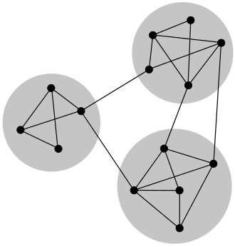
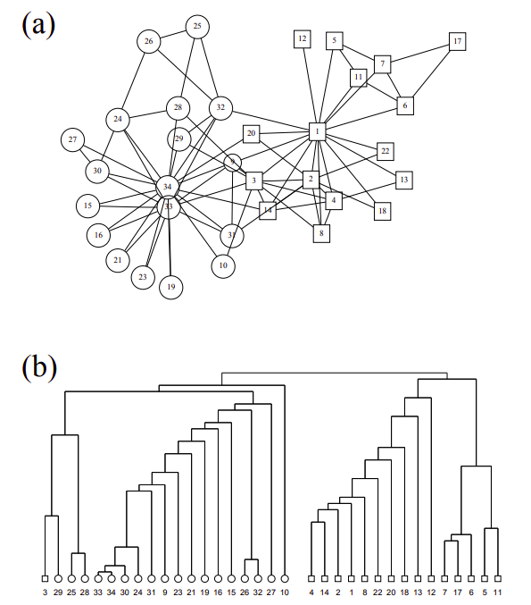
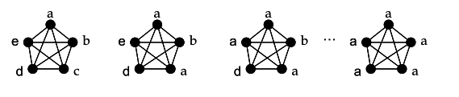
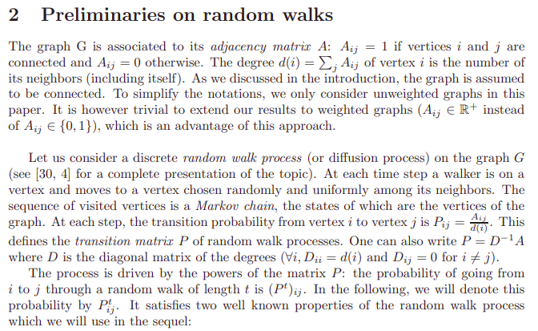
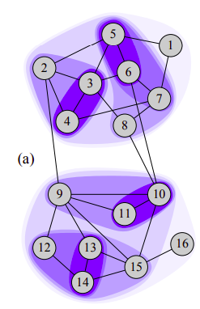
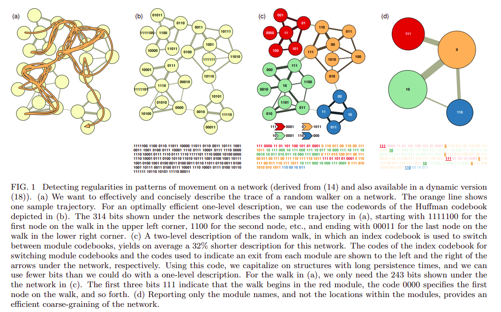
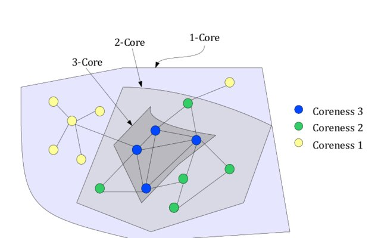

```{r setup, include=FALSE}
knitr::opts_chunk$set(cache=TRUE)
knitr::opts_chunk$set(echo = TRUE)
```

## Load libraries
```{r, message=FALSE}
library(dplyr)
library(igraph)
library(ggplot2)
library(tidygraph)
library(networkD3)
library(visNetwork)
library(knitr) # For table rendering
```

<br>

## Graph object
```{r}
df = read.table("./data/data.tsv", header = T)
veccol = c(rep("pink",5), rep("light blue",6))
g = graph_from_data_frame(df)
net = g
```

<br>

## Community detection
A number of algorithms aim to detect groups that consist of densely connected nodes with fewer connections across groups.

In the study of complex networks, a network is said to have community structure if the nodes of the network can be easily grouped into (potentially overlapping) sets of nodes such that each set of nodes is densely connected internally. In the particular case of non-overlapping community finding, this implies that the network divides naturally into groups of nodes with dense connections internally and sparser connections between groups. But overlapping communities are also allowed. The more general definition is based on the principle that pairs of nodes are more likely to be connected if they are both members of the same community(ies), and less likely to be connected if they do not share communities [3]. 

A sketch of a small network displaying community structure, with three groups of nodes with dense internal connections and sparser connections between groups [3].




Summary of community detection algorithms in igraph 0.6: https://www.r-bloggers.com/summary-of-community-detection-algorithms-in-igraph-0-6/


<br>


## Cliques 
Cliques are subgraphs in which every node is connected to every other node in the clique i.e. complete subgraphs of an undirected graph [3].

As nodes can not be more tightly connected than this, it is not surprising that there are many approaches to community detection in networks based on the detection of cliques in a graph and the analysis of how these overlap. 

Note that as a node can be a member of more than one clique, a node can be a member of more than one community in these methods giving an "overlapping community structure". One approach is to find the **"maximal cliques"**, that is find the cliques which are not the subgraph of any other clique. 


```{r}
# Find cliques
net.sym <- as.undirected(net, mode= "collapse")
head(cliques(net.sym)) # list of cliques       
sapply(cliques(net.sym), length) # clique sizes
sapply(cliques(net.sym), length) %>% table() %>% as.data.frame() %>% {colnames(.)[1]="size"; .} %>% ggplot(aes(x=size, y= Freq, fill=size))+geom_col()
largest_cliques(net.sym) # cliques with max number of nodes

# clique.number calculates the size of the largest clique(s).
clique.number(net.sym)

# plot
vcol <- rep("grey80", vcount(net.sym))
vcol[unlist(largest_cliques(net.sym))] <- "gold"
plot(as.undirected(net.sym), vertex.label=V(net.sym)$name, vertex.color=vcol)

# cliques with minimum 6 nodes
cliques(net.sym, min=6)

# calculate all the maximal cliques in an undirected graph
# maximal cliques: cliques which are not the subgraph of any other clique.
max_cliques(net.sym)
```

<br>


## Key functions to deal with the result of network community detection
Key functions to deal with the result of network community detection

* membership: For each node, returns id of its community
* modularity: modularity gives the modularity score of the partitioning.
* length: returns the number of communities.
* sizes: The sizes function returns the community sizes, in the order of their ids.
* algorithm: algorithm gives the name of the algorithm that was used to calculate the community structure.
* crossing: crossing returns a logical vector, with one value for each edge, ordered according to the edge ids. The value is TRUE iff the edge connects two different communities, according to the (best) membership vector, as returned by membership()
* code_len


<br>


## Based on edge betweenness (Newman-Girvan)
The edge betweenness score of an edge measures the number of shortest paths through it. The idea of the edge betweenness based community structure detection is that it is likely that edges connecting separate modules have high edge betweenness as all the shortest paths from one module to another must traverse through them. So if we gradually remove the edge with the highest edge betweenness score we will get a hierarchical map, a rooted tree, called a dendrogram of the graph. The leafs of the tree are the individual vertices and the root of the tree represents the whole graph.

High-betweenness edges are removed sequentially (recalculating at each step) and the best partitioning of the network is selected i.e. cluster_edge_betweenness performs this algorithm by calculating the edge betweenness of the graph, removing the edge with the highest edge betweenness score, then recalculating edge betweenness of the edges and again removing the one with the highest score, etc.

Further reading: https://arxiv.org/pdf/cond-mat/0112110.pdf



The hierarchical tree showing the complete community
structure for the network.


```{r}
ceb <- cluster_edge_betweenness(net) 
length(ceb)     # number of communities
ceb
sizes(ceb) # sizes of communities
membership(ceb) # community membership for each node
modularity(ceb) # how modular the graph partitioning is
plot(ceb, net)
```

<br>


## Community detection based on based on propagating labels
Assigns node labels, randomizes, than replaces each vertex’s label with the label that appears most frequently among neighbors. Those steps are repeated until each vertex has the most common label of its neighbors. In other words 

From the abstract of the paper https://arxiv.org/abs/0709.2938: “In our algorithm every node is initialized with a unique label and at every step each node adopts the label that most of its neighbors currently have. In this iterative process densely connected groups of nodes form a consensus on a unique label to form communities.”



Nodes are updated one by one as we move from left to right. Due to a high density of edges (highest possible in this case), all nodes acquire the same label.


```{r}
clp <- cluster_label_prop(net)
length(clp)     # number of communities
clp
sizes(clp) # sizes of communities
membership(clp) # community membership for each node
modularity(clp) # how modular the graph partitioning is
plot(clp, net)
```

<br>


## Community detection based on greedy optimization of modularity
This function tries to find dense subgraph, also called communities in graphs via directly optimizing a modularity score. 

Modularity [21] is a property of a network and a specific proposed division of that network into communities. It measures when the division is a good one, in the sense
that there are many edges within communities and only a few between them. 
https://arxiv.org/pdf/cond-mat/0408187.pdf

Modularity is one measure of the structure of networks or graphs. It was designed to measure the strength of division of a network into modules (also called groups, clusters or communities). Networks with high modularity have dense connections between the nodes within modules but sparse connections between nodes in different modules. https://en.wikipedia.org/wiki/Modularity_(networks) 

```{r}
cfg <- cluster_fast_greedy(as.undirected(net))
length(cfg)     # number of communities
cfg
membership(cfg) # community membership for each node
sizes(cfg) # sizes of communities
plot(cfg, as.undirected(net))
plot_dendrogram(cfg)
modularity(cfg) # how modular the graph partitioning is i.e more modular a graph is more easy would be graph particioning n hence community detection
crossing(cfg, net)
```

<br>


## Optimal community detection
Group nodes by optimising the moldularity score. This function calculates the optimal community structure of a graph, by maximizing the modularity measure over all possible partitions. 

**Note that modularity optimization is an NP-complete problem, and all known algorithms for it have exponential time complexity. This means that you probably don't want to run this function on larger graphs. Graphs with up to fifty vertices should be fine, graphs with a couple of hundred vertices might be possible.**

```{r, eval=FALSE}
# GLPK needs to be installed
# The calculation is done by transforming the modularity maximization into an integer programming problem, and then calling the GLPK library to solve that.

oc <- cluster_optimal(g)
plot(c4, g)
```

<br>


## Community strucure via short random walks
This function tries to find densely connected subgraphs, also called communities in a graph via random walks. The idea is that short random walks tend to stay in the same community. 

https://arxiv.org/abs/physics/0512106

Steps parameter decides: The length of the random walks to perform.





An example of community structure found by our algorithm using random walks of length t = 3. 


```{r}
cwt = cluster_walktrap(net)
plot(cwt, as.undirected(net))
plot_dendrogram(cwt)
print(cwt)
modularity(cwt)
sizes(cwt)
membership(cwt)


# tune stepsize
cwt = cluster_walktrap(net, steps = 4)
plot(cwt, as.undirected(net))

```


<br>


## Infomap community finding
Find community structure that minimizes the expected description length of a random walker trajectory.

Information flow-based and information-theoretic method to detect community. Maps of information flow reveal community structure in complex networks. [https://arxiv.org/abs/0906.1405]



Many real-world networks are structured into a set of regions such that once the random walker enters a region, it tends to stay there for a long time, and movements between regions are relatively rare.

```{r}
plot(cluster_infomap(net), as.undirected(g))
```

<br>


## Spectral community detection
Group nodes based on the leading eigenvector of the modularity matrix. This function tries to find densely connected subgraphs in a graph by calculating the leading non-negative eigenvector of the modularity matrix of the graph.

```{r}
c2 = cluster_leading_eigen(as.undirected(g))
plot(c2, g)
```

<br>


## Hieararchical clustering based 
Another method for finding community structures in networks is hierarchical clustering. In this method one defines a similarity measure quantifying some (usually topological) type of similarity between node pairs. Commonly used measures include the cosine similarity, the Jaccard index, and the Hamming distance between rows of the adjacency matrix. Then one groups similar nodes into communities according to this measure. There are several common schemes for performing the grouping, the two simplest being single-linkage clustering, in which two groups are considered separate communities if and only if all pairs of nodes in different groups have similarity lower than a given threshold, and complete linkage clustering, in which all nodes within every group have similarity greater than a threshold.
https://en.wikipedia.org/wiki/Community_structure#Hierarchical_clustering

```{r}
# Obtain adjancy matrix
A = get.adjacency(g, sparse=FALSE)

# Calculate cosine similarity from Latent Semantic Analysis package
# library(lsa)
# S = cosine(A)
# D = 1-S # Convert similarity to distance
# d = as.dist(D) # Convert distance matrix to dist() object
# Error if NA/NaN/Inf is found in d

# Pearson similarity based
# S = cor(A, method="pearson")
# d = as.dist(1-S)
# Error if NA/NaN/Inf is found in d

# Hamming distance based measurement
library(e1071)
d = hamming.distance(A) %>% as.dist()

# Perform average-linkage hierarchical clustering method
cc = hclust(d, method = "single")

# plot dendrogram
plot(cc)

# draw blue borders around clusters
clusters.list = rect.hclust(cc, k = 4, border="blue")

# cut dendrogram at 4 clusters
clusters = cutree(cc, k = 4)

# plot graph with clusters
plot(g, vertex.color=clusters)
```

We can also plot the communities without relying on their built-in plot:
```{r}

V(net)$community <- cfg$membership
colrs <- adjustcolor( c("gray50", "tomato", "gold", "yellowgreen"), alpha=.6)
plot(net, vertex.color=colrs[V(net)$community])
```

<br>


## K-core decomposition
Coreness is a measure that can help identify **tightly interlinked groups** within a network. 

A k-core is a maximal group of entities, all of which are connected to at least k other entities in the group. The k-core is the maximal subgraph in which every node has degree of at least k. 

e.g. in a 5-core subgraph, every node has degree of at least 5. For example, a group is the two-core if it contains all entities that are connected to at least two other entities within the group. Similarly, a group is the three-core if it contains all entities that are linked to at least three other entities within the group.

The result here gives the coreness of each vertex in the network. A node has coreness D if it belongs to a D-core but not to (D+1)-core.



Refer: https://www.ibm.com/support/knowledgecenter/en/SSXVXZ_2.2.0/com.ibm.i2.anb.doc/about_k_core.html


Any entity in the three-core must have at least three links to all other members of the three-core. Clearly any such entity must necessarily have at least two links to every other member of the three-core. Put another way, the three-core is a subset (is contained within) the two-core. More generally, the K-Core form a nested hierarchy of entity groupings on the chart. The zero-core (entire chart) contains the one-core, which contains the two-core, which contains the three-core, and so on. As k increases, the core sizes decrease, but the cores become more interlinked. The K-Cores with the biggest coreness values (k-values) represent the most cohesive regions of the chart.

The following diagram illustrates the K-Core decomposition of a simple network, and shows a nested collection of zero, one, two and three-cores. Notice that the three-core actually consists of two separate groupings on the chart. Technically these groupings are regarded as a single three-core with two components.

Diagram indicating a K-Core structure.


```{r}
# mode: The type of the core in directed graphs. Character constant, possible values: in: in-cores are computed, out: out-cores are computed, all: the corresponding undirected graph is considered. This argument is ignored for undirected graphs.
kc <- coreness(net, mode="all")
print(kc)
plot(net, vertex.size=kc*6, vertex.label=kc)
```


## Decompose
Creates a separate graph for each component of a graph.
```{r}
# the diameter of each component in a random graph
g1 <- sample_gnp(1000, 1/1000)
plot(g1, vertex.size = 1, vertex.label = NA)
components <- decompose(g1, min.vertices=8)
sapply(components, diameter)
print(components[[1]])
plot(components[[1]])
```

