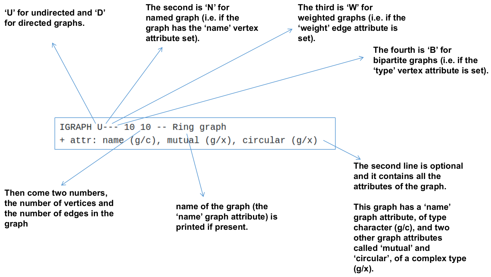

```{r setup, include=FALSE}
knitr::opts_chunk$set(cache=TRUE)
knitr::opts_chunk$set(echo = TRUE)
```

## Install libraries
```{r, eval=FALSE}
install.packages(c("igraph","dplyr","ggplot2","tidygraph","networkD3","visNetwork"))
```

<br>

## Load libraries
```{r, message=FALSE}
library(dplyr)
library(igraph)
library(ggplot2)
library(tidygraph)
library(networkD3)
library(visNetwork)
library(knitr) # For table rendering
```

<br>

## Overall theme


<hr>

<br>

## Data to be used in the study
```{r}
df = read.table("./data/data.tsv", header = T)
kable(head(df))
dim(df)
```

<br>

## iGraph Functions to create graph


<hr>

## Graph from a data frame
```{r}
g = graph_from_data_frame(df)
print(g)
```

<br>

#### Example of graph object



<hr>

<br>

The description of an igraph object starts with up to four letters:

* D or U, for a directed or undirected graph
* N for a named graph (where nodes have a name attribute)
* W for a weighted graph (where edges have a weight attribute)
* B for a bipartite (two-mode) graph (where nodes have a type attribute)

The description also lists node & edge attributes, for example:

* (g/c) - graph-level character attribute
* (v/c) - vertex-level character attribute
* (e/n) - edge-level numeric attribute

So we can see from first line, graph object g is Directed, Named with 11 nodes and 32 edges. Second line shows that nodes have one attribute (name of type character (g/c) )

<br>

## Plot graph using plot()
```{r}
plot(g)
```

<br>

## Make a undirected graph
```{r}
g1 = graph_from_data_frame(df, directed = F);
plot(g1)
print(g1)
```

<br>

## Node and Edge details

<br>


### Node details
```{r}
# Get nodes
# Get nodes
V(g)
# Total nodes
vcount(g)
# Get vertices name
V(g)$name
```

<br>

### Edge details
```{r}
# Get edges
E(g)
# Edge count
ecount(g)
# Edges
head( E(g)[[]] )
```

<br>

## Plot Parameters

### Vertex parameters

* **vertex.color** 	 Node color
* **vertex.frame.color** 	 Node border color
* **vertex.shape** 	 One of “none”, “circle”, “square”, “csquare”, “rectangle”, “crectangle”, “vrectangle”, “pie”, “raster”, or “sphere”
* **vertex.size** 	 Size of the node (default is 15)
* **vertex.size2** 	 The second size of the node (e.g. for a rectangle)
* **vertex.label** 	 Character vector used to label the nodes
* **vertex.label.family** 	 Font family of the label (e.g.“Times”, “Helvetica”)
* **vertex.label.font** 	 Font: 1 plain, 2 bold, 3, italic, 4 bold italic, 5 symbol
* **vertex.label.cex** 	 Font size (multiplication factor, device-dependent)
* **vertex.label.dist** 	 Distance between the label and the vertex
* **vertex.label.degree** 	 The position of the label in relation to the vertex,where 0 right, “pi” is left, “pi/2” is below, and “-pi/2” is above

<br>

### Edge parameters
* edge.color 	 Edge color
* edge.width 	 Edge width, defaults to 1
* edge.arrow.size 	 Arrow size, defaults to 1
* edge.arrow.width 	 Arrow width, defaults to 1
* edge.lty 	 Line type, could be 0 or “blank”, 1 or “solid”, 2 or “dashed”,3 or “dotted”, 4 or “dotdash”, 5 or “longdash”, 6 or “twodash”
* edge.label 	 Character vector used to label edges
* edge.label.family 	 Font family of the label (e.g.“Times”, “Helvetica”)
* edge.label.font 	 Font: 1 plain, 2 bold, 3, italic, 4 bold italic, 5 symbol
* edge.label.cex 	 Font size for edge labels
* edge.curved 	 Edge curvature, range 0-1 (FALSE sets it to 0, TRUE to 0.5)
* arrow.mode 	 Vector specifying whether edges should have arrows,
* possible values: 0 no arrow, 1 back, 2 forward, 3 both

<br>


<br>


```{r}
plot(g, 
     edge.arrow.size=0.1, 
     vertex.color="gold", 
     vertex.size=20,
     vertex.frame.color="gray",
     vertex.label.color="black",
     vertex.label.cex=0.8,
     vertex.label.dist=3,
     edge.curved=0.2)
```

<br>

### Color the vertices
```{r}
# color vector of length = number of nodes
veccol = c(rep("pink",5), rep("light blue",6))
plot(g,
     edge.arrow.size=0.1, 
     vertex.color=veccol, 
     vertex.size=20,
     vertex.frame.color="gray",
     vertex.label.color="black",
     vertex.label.cex=0.8,
     vertex.label.dist=3,
     edge.curved=0.2)
```

<br>

### Node size
```{r}
# Randomly create a vector of size = total nodes
set.seed(123)
V(g)$size = sample(c(30:50),11, replace = T)
plot(g,
     edge.arrow.size=0.1,
     vertex.color=veccol,
     vertex.size=V(g)$size,
     vertex.frame.color="gray",
     vertex.label.color="black",
     vertex.label.cex=0.8,
     vertex.label.dist=3,
     edge.curved=0.2)
```

<br>

### Add vertex attributes
```{r}
set.seed(123)
total_mutations = sample(x = 0:30, size = vcount(g))
set_vertex_attr(graph = g, name = "Mutation", value = total_mutations)
print(g)
# List of vertex attributes
vertex_attr(g)
plot(g,
     edge.arrow.size=0.1,
     vertex.color=veccol,
     vertex.size=total_mutations,
     vertex.frame.color="gray",
     vertex.label.color="black",
     vertex.label.cex=0.8,
     vertex.label.dist=3,
     edge.curved=0.2)
```

