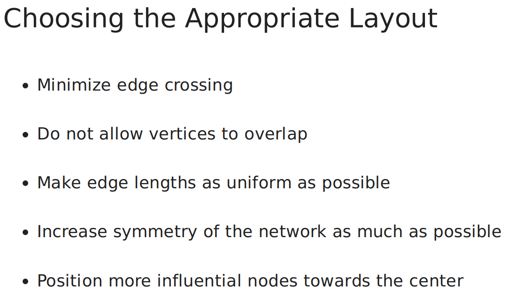
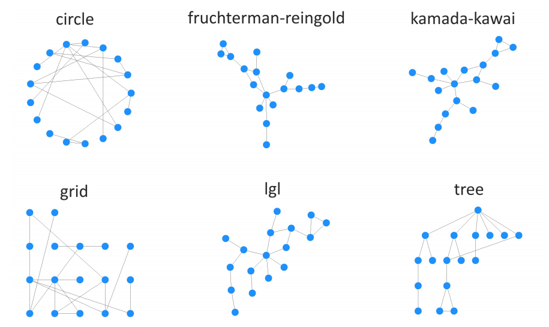

```{r setup, include=FALSE}
knitr::opts_chunk$set(cache=TRUE)
knitr::opts_chunk$set(echo = TRUE)
```

## Load libraries
```{r, message=FALSE}
library(dplyr)
library(igraph)
library(ggplot2)
library(tidygraph)
library(networkD3)
library(visNetwork)
library(knitr) # For table rendering
```

<br>

## Graph object
```{r}
df = read.table("./data/data.tsv", header = T)
veccol = c(rep("pink",5), rep("light blue",6))
g = graph_from_data_frame(df)
```

<br>

## Network layouts
In very short terms, a layout is the vertical and horizontal placement of nodes when plotting a particular graph structure. Conversely, a layout algorithm is an algorithm that takes in a graph structure (and potentially some additional parameters) and return the vertical and horizontal position of the nodes [1].

<hr>



<hr>



<br>

### Randomly place vertices on a plane or in 3d space
This function uniformly randomly places the vertices of the graph in two or three dimensions.
```{r}
plot(g, 
     layout=layout_randomly,
     edge.arrow.size=0.1, 
     vertex.color=veccol, 
     vertex.size=20,
     vertex.frame.color="gray",
     vertex.label.color="black",
     vertex.label.cex=0.8,
     vertex.label.dist=3,
     edge.curved=0.2)
```

### Vertices of a graph in a star-shape
A simple layout generator, that places one vertex in the center of a circle and the rest of the vertices equidistantly on the perimeter.
```{r}
plot(g, 
     layout=layout_as_star,
     edge.arrow.size=0.1,
     vertex.color=veccol,
     vertex.size=20,
     vertex.frame.color="gray",
     vertex.label.color="black",
     vertex.label.cex=0.8,
     vertex.label.dist=3,
     edge.curved=0.2)
```

### Tree Layout (The Reingold-Tilford graph layout algorithm)
A tree-like layout, it is perfect for trees, acceptable for graphs with not too many cycles. Arranges the nodes in a tree where the given node is used as the root. The tree is directed downwards and the parents are centered above its children.

```{r}
plot(g, 
     layout=layout_as_tree,
     edge.arrow.size=0.1,
     vertex.color=veccol,
     vertex.size=20,
     vertex.frame.color="gray",
     vertex.label.color="black",
     vertex.label.cex=0.8,
     vertex.label.dist=3,
     edge.curved=0.2)
```

### Graph layout with vertices on a circle.
Place vertices on a circle, in the order of their vertex ids.
```{r}
plot(g, 
     layout=layout_in_circle,
     edge.arrow.size=0.1,
     vertex.color=veccol,
     vertex.size=20,
     vertex.frame.color="gray",
     vertex.label.color="black",
     vertex.label.cex=0.8,
     vertex.label.dist=3,
     edge.curved=0.2)
```

### Graph layout with vertices on the surface of a sphere
Place vertices on a sphere, approximately uniformly, in the order of their vertex ids. This is thus a 3d layout
```{r}
plot(g, 
     layout=layout_on_sphere,
     edge.arrow.size=0.1,
     vertex.color=veccol,
     vertex.size=20,
     vertex.frame.color="gray",
     vertex.label.color="black",
     vertex.label.cex=0.8,
     vertex.label.dist=3,
     edge.curved=0.2)
```

### Simple grid layout
This layout places vertices on a rectangulat grid, in two or three dimensions.
```{r}
plot(g, 
     layout=layout_on_grid,
     edge.arrow.size=0.1, 
     vertex.color=veccol,
     vertex.size=20,
     vertex.frame.color="gray",
     vertex.label.color="black",
     vertex.label.cex=0.8,
     vertex.label.dist=3,
     edge.curved=0.2)
```

### Force-directed layouts (The Fruchterman-Reingold layout algorithm)
Place vertices on the plane using the force-directed layout algorithm by Fruchterman and Reingold.
```{r}
plot(g, 
     layout=layout_with_fr,
     edge.arrow.size=0.1, 
     vertex.color=veccol, 
     vertex.size=20,
     vertex.frame.color="gray",
     vertex.label.color="black",
     vertex.label.cex=0.8,
     vertex.label.dist=3,
     edge.curved=0.2)
```

### The Kamada-Kawai layout algorithm
Another popular force-directed algorithm that produces nice results for connected graphs is Kamada Kawai
```{r}
plot(g, 
     layout=layout_with_kk,
     edge.arrow.size=0.1,
     vertex.color=veccol,
     vertex.size=20,
     vertex.frame.color="gray",
     vertex.label.color="black",
     vertex.label.cex=0.8,
     vertex.label.dist=3,
     edge.curved=0.2)
```

### Large Graph Layout
A layout generator for larger graphs.

```{r}
plot(g, 
     layout=layout_with_lgl,
     edge.arrow.size=0.1,
     vertex.color=veccol,
     vertex.size=20,
     vertex.frame.color="gray",
     vertex.label.color="black",
     vertex.label.cex=0.8,
     vertex.label.dist=3,
     edge.curved=0.2)
```

### Automatic layout
This function tries to choose an appropriate graph layout algorithm for the graph, automatically, based on a simple algorithm.
```{r}
plot(g, 
     layout=layout_nicely,
     edge.arrow.size=0.1,
     vertex.color=veccol, 
     vertex.size=20,
     vertex.frame.color="gray",
     vertex.label.color="black",
     vertex.label.cex=0.8,
     vertex.label.dist=3,
     edge.curved=0.2)
```


### On single plot
```{r}
layouts <- grep("^layout_", ls("package:igraph"), value=TRUE)[-1] 
layouts <- layouts[!grepl("bipartite|merge|norm|sugiyama|tree", layouts)]
par(mfrow=c(3,3), mar=c(1,1,1,1))
for (layout in layouts) {
  print(layout)
  l <- do.call(layout, list(g)) 
  plot(g, edge.arrow.mode=0, layout=l, main=layout) 
}
par(mfrow=c(1,1))
```

## References
1. https://www.data-imaginist.com/2017/ggraph-introduction-layouts/
