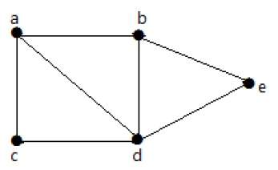

```{r setup, include=FALSE}
knitr::opts_chunk$set(cache=TRUE)
knitr::opts_chunk$set(echo = TRUE)
```

## Load libraries
```{r, message=FALSE}
library(dplyr)
library(igraph)
library(ggplot2)
library(tidygraph)
library(networkD3)
library(visNetwork)
library(knitr) # For table rendering
```

<br>

## Graph object
```{r}
df = read.table("./data/data.tsv", header = T)
veccol = c(rep("pink",5), rep("light blue",6))
g = graph_from_data_frame(df)
```

<br>

## Graph measurements
* adhesion (edge connectivity) or cohesion (vertex connectivity)
* assortativity
* diameter
* girth
* radius
* mutual_count
* edge density
* automorphisms
* unconn_count
* size
* reciprocity
* mean_dist

<br>

## Size
Counts the number of edges in the graph
```{r}
gsize(g)
```

<br>

## Order
Order (number of vertices) of a graph
```{r}
gorder(g)
```

<br>

## Eccentricity
The eccentricity of a vertex is its shortest path distance from the farthest other node in the graph.


<br>


```{r}
plot(g,edge.arrow.mode=0,vertex.label.cex=0.8,vertex.label.dist=3)
eccentricity(g)
```

<br>


## Diameter
A network diameter is the longest geodesic distance (length of the shortest path between two nodes) in the network. 

In igraph, 

* diameter() returns the distance
* get_diameter() returns the nodes along the first found path of that distance.


<br>

```{r}
plot(g,edge.arrow.mode=0,vertex.label.cex=0.8,vertex.label.dist=3)
diameter(g)
```

<br>


```{r}
diam <- get_diameter(g, directed=T)
diam
```

<br>

### Color nodes along the diameter
```{r}
vcol <- rep("gray40", vcount(g))
vcol[diam] <- "gold"
ecol <- rep("gray80", ecount(g))
ecol[E(g, path=diam)] <- "orange" 
plot(g, 
     vertex.color=vcol, 
     edge.color=ecol, 
     edge.arrow.mode=0,
     vertex.label.cex=0.8,
     vertex.label.dist=3
     )
```

<br>

## Radius
The eccentricity of a vertex is its shortest path distance from the farthest other node in the graph. The smallest eccentricity in a graph is called its radius. The eccentricity of a vertex is calculated by measuring the shortest distance from (or to) the vertex, to (or from) all vertices in the graph, and taking the maximum.


<br>

```{r}
eccentricity(g)
radius(g)
```


<br>


## Girth
The girth of a graph is the length of the shortest circle in it. In graph theory, the girth of a graph is the length of a shortest cycle contained in the graph.[1] If the graph does not contain any cycles (i.e. it's an acyclic graph), its girth is defined to be infinity.[2] For example, a 4-cycle (square) has girth 4. A grid has girth 4 as well, and a triangular mesh has girth 3. A graph with girth four or more is triangle-free. https://en.wikipedia.org/wiki/Girth_(graph_theory) 


<br>


<br>

```{r}
set.seed(7) 
gir = girth(g)
print(gir)
veccol = rep("gold", vcount(g))
veccol[which(names(V(g)) %in% names(gir$circle))]="blue"
plot(g, vertex.color = veccol)
```

<br>

## Edge density
The proportion of present edges from all possible edges in the network. This denotes how dense a graph is. A dense graph is a graph in which the number of edges is close to the maximal number of edges. The opposite, a graph with only a few edges, is a sparse graph. 


```{r}
# Ignore the edges connecting same node. i.e. edge between node A to A
# max edge: N*(N-1) where N is total nodes
# if e is total edge, then edge density is e/N*(N-1)
edge_density(g, loops=F)

# Include the edges connecting same node. i.e. edge between node A to A
# max edge: N*N where N is total nodes
# if e is total edge, then edge density is e/N*N
edge_density(g, loops=T)

ecount(g)/(vcount(g)*(vcount(g)-1))
```

<br>


## Group Adhesion or Cohesion
Group Adhesion (Edge connectivity) or Cohesion (Vertex connectivity)

What we call cohesion is the contribution made by (adding or subtracting) individual members of a group, together with their ties, to holding it together. What we call adhesion (edge cohesion) is the contribution made to holding a group together—keeping membership constant—by (adding or subtracting) ties between its members. https://onlinelibrary.wiley.com/doi/10.1111/0081-1750.00098 

Connectivity of a graph: A graph is said to be connected if there is a path between every pair of vertex. From every vertex to any other vertex, there should be some path to traverse. That is called the connectivity of a graph. A graph with multiple disconnected vertices and edges is said to be disconnected.
https://www.tutorialspoint.com/graph_theory/graph_theory_connectivity.htm

Connected graph



Disconnected graph
 

In the above example, traversing from vertex ‘a’ to vertex ‘f’ is not possible because there is no path between them directly or indirectly. Hence it is a disconnected graph.

<br>


### Adhesion (Edge connectivity)

* The **edge connectivity of a pair of vertices** (source and target) is the minimum number of edges needed to remove to eliminate all (directed) paths from source to target.
* The **edge connectivity lambda of the graph G** is the minimum number of edges that need to be deleted, such that the graph G gets disconnected.

https://cp-algorithms.com/graph/edge_vertex_connectivity.html#toc-tgt-1

For example an already disconnected graph has an edge connectivity of 0

A connected graph with at least one bridge has an edge connectivity of 1

A connected graph with no bridges has an edge connectivity of at least 2.

```{r}
g1 = graph.union(graph.ring(9), graph.star(10, c=9, mode="undirected"))
plot(g1)

# we need to remove 2 edge (1-9 and 1-2) to make 1 disconnected from 6
edge_connectivity(g1, 1, 6)

# we need to remove 1 edge (9-10) to make 10 disconnected from 9
edge_connectivity(g1, 1, 10)

# Therefore Graph's edge connectivity is 1
edge_connectivity(g1)

# In our example, edge connectivity is 1 since minimum number of edges that need to be deleted to make a graph disconnected is 1 which is deletion of edge 9-10
edge_connectivity(as.undirected(g1))
```

<br>


### Cohesion (Vertex connectivity)
The vertex connectivity of two vertices (source and target) in a directed graph is the minimum number of vertices needed to remove from the graph to eliminate all (directed) paths from source to target. vertex_connectivity calculates this quantity if both the source and target arguments are given and they're not NULL. Note that this quantity is not defined if source and target are adjacent.

```{r}
plot(g1)
vertex_connectivity(g1, 1, 6)
vertex_connectivity(g1)
```


<br>


