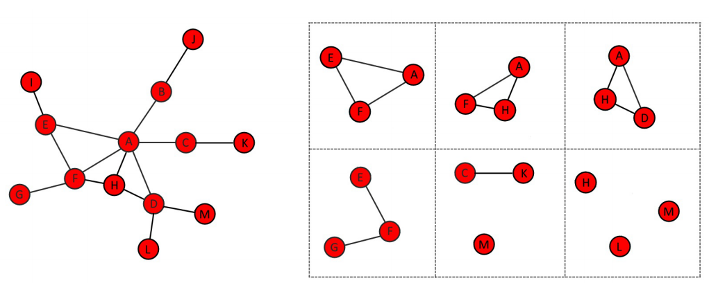
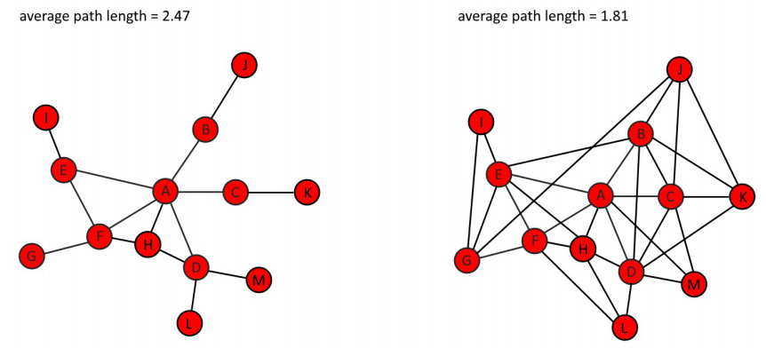

```{r setup, include=FALSE}
knitr::opts_chunk$set(cache=TRUE)
knitr::opts_chunk$set(echo = TRUE)
```

## Load libraries
```{r, message=FALSE}
library(dplyr)
library(igraph)
library(ggplot2)
library(tidygraph)
library(networkD3)
library(visNetwork)
library(knitr) # For table rendering
```

<br>

## Graph object
```{r}
df = read.table("./data/data.tsv", header = T)
veccol = c(rep("pink",5), rep("light blue",6))
g = graph_from_data_frame(df)
net = g
```

<br>

## Node degrees
The function degree() has a mode of in for in-degree, out for out-degree, and all or total for total degree
```{r}
deg <- degree(net, mode="all")
print(sort(deg))
plot(net, vertex.size=deg*3)
hist(deg, breaks=1:vcount(net)-1, main="Histogram of node degree")
```

<br>

## Centrality
Read https://towardsdatascience.com/graph-analytics-introduction-and-concepts-of-centrality-8f5543b55de3

Centrality applies to node level while Centralization applies to graph level

## Degree centrality

Degree centrality measures how connected an entity is by counting the number of direct links each entity has to others in the network. This centrality measure can reveal how much activity is going on and who are its most active members.[1]


```{r}
# mode: in/out/all or total
degree(net, mode="in")
```

## Closeness centrality

Centrality is based on the distance to others in the graph. Calculated as inverse of the node’s average geodesic distance to others in the network. 

Closeness centrality measures the proximity of an entity to the other entities in the social network [1]. An entity with a high measure of closeness centrality has the shortest paths to the other entities. This measure allows them to pass on, and receive communications more quickly than anybody else in the organization. Information travels further to and from an entity on the edge of a network that is attached to few other entities. They have a lower measure of closeness centrality.

Closeness centrality measures both direct and indirect closeness: [1]

* Direct closeness is when two entities are connected by a link.
* Indirect closeness exists when information can pass only from one entity to another by way of a path that runs through one or more entities.


```{r}
closeness(net, mode="all", weights=NA) 
centr_clo(net, mode="all", normalized=T) 
```

## Betweenness centrality
Centrality based on a broker position connecting others. Number of geodesics that pass through the node or the edge. The vertex and edge betweenness are (roughly) defined by the number of geodesics (shortest paths) going through a vertex or an edge.

Betweenness centrality measures the number of paths that pass through each entity. This measure might identify entities with the ability to control information flow between different parts of the network. These entities are called gatekeeper entities. Gatekeepers might have many paths that run through them that allows them to channel information to most of the others in the network. Alternatively, they might have few paths that run through them, but still play a powerful communication role if they exist between different network clusters [1].

```{r}
betweenness(net, directed=T, weights=NA)
edge_betweenness(net, directed=T, weights=NA)
centr_betw(net, directed=T, normalized=T)
```

## Eigenvector Centrality
This metric measures the importance of a node in a graph as a function of the importance of its neighbors. If a node is connected to highly important nodes, it will have a higher Eigen Vector Centrality score as compared to a node which is connected to lesser important nodes.

Eigenvector measures how connected an entity is and how much direct influence it might have over other connected entities in the network [1]. The eigenvector scores of the entities it is connected to, is considered. For example, a person with a high eigenvector score is likely to be at the center of a cluster of key entities that themselves have high eigenvector scores. That person can communicate directly with those key entities compared with a person with a low eigenvector score on the periphery of the network.

Hubs and authorities are the terms that are used to describe the two eigenvector scores that are calculated in networks that contain directed links. Hubs see the scores for outbound links, and authorities see the scores for inbound links. A high-scoring hub has many outbound links to high-scoring authorities, and a high-scoring authority has many inbound links from high-scoring hubs. [1]


```{r}
eigen_centrality(g)$vector
```

## Pagerank centrality
Calculates the Google PageRank for the specified vertices. For the explanation of the PageRank algorithm, see the following webpage: http://infolab.stanford.edu/~backrub/google.html

```{r}
page_rank(g)
```

## Centralization
Centralization is a method for creating a graph level centralization measure from the centrality scores of the vertices.
```{r}
# Returns res - 
# vertex centrality, 
# centralization, and 
# theoretical_max - maximum centralization score for a graph of that size.

# Centralize a graph according to the degrees of vertices
centr_degree(net, mode="in", normalized=T)$centralization

# Centralize a graph according to the betweenness of vertices
centr_betw(net)$centralization

# Centralize a graph according to the eigenvector centrality of vertices
centr_eigen(net)$centralization
```

## Hubs and authorities

 - Hubs: large number of outgoing links
 - Authorities would get many incoming links from hubs

Hubs and authorities are the terms that are used to describe the two eigenvector scores that are calculated in networks that contain directed links. Hubs see the scores for outbound links, and authorities see the scores for inbound links. A high-scoring hub has many outbound links to high-scoring authorities, and a high-scoring authority has many inbound links from high-scoring hubs. [1]

Hub: A measure of how well-connected an entity is, based on its outbound links. Hub is one of two eigenvector centrality measures used in social network analysis.

Authorities: A measure of how well-connected an entity is, based on its inbound links. Authority is one of two eigenvector centrality measures used in social network analysis. [1]

```{r}
hs <- hub_score(net, weights=NA)$vector
as <- authority_score(net, weights=NA)$vector
par(mfrow=c(1,2))
plot(net, vertex.size=hs*50, main="Hubs", edge.arrow.size=0.1, vertex.color=veccol, vertex.frame.color="gray",vertex.label.color="black",vertex.label.cex=0.8,vertex.label.dist=3,edge.curved=0.2)
plot(net, vertex.size=as*30, main="Authorities",,edge.arrow.size=0.1, vertex.color=veccol,vertex.frame.color="gray",vertex.label.color="black",vertex.label.cex=0.8,vertex.label.dist=3,edge.curved=0.2)
```

## Combine all centrality measures
```{r}
# Directed graph
plot(g)
d1 = degree(g)
cl = closeness(g)
bet = betweenness(g)
eig = eigen_centrality(g)$vector
pg = page_rank(g)$vector
hs <- hub_score(g, weights=NA)$vector
as <- authority_score(g, weights=NA)$vector

centdf = data.frame(degree = d1, closeness = cl, bet = bet, eig= eig, pg = pg, hs = hs, as = as)

cor(centdf)
corrplot::corrplot(cor(centdf))


```

## Transitivity
Transitivity measures the probability that the adjacent vertices of a vertex are connected. This is sometimes also called the clustering coefficient.

It calculates the fraction of connected **triplets** that are **closed triangles** for a given network. A connected triplet is three nodes, where at least two pairs of them are connected; a **triangle means** that every pair of the three nodes is connected. A triangle is a triplet but not the vice versa. For example, if A is friend of B and B is a friend of C, then A-B-C is a triplet; if furthermore, A and C are also friends, then A-B-C is a triangle. Hence, **a large value of transitivity means that most triplets are triangles.** ***In other words, your friends are also likely friends with each other.***




There are two versions of transitivity: **global and local**. For a given network, the global transitivity calculates the ratio between the total number of triangles and the total number of triplets, while the local transitivity is defined for each node and calculates the ratio between the number of triangles and the number of triplets centered at each node.

* global - ratio of triangles (direction disregarded) to connected triples.
* local - ratio of triangles to connected triples each vertex is part of.


```{r}
V(net)

transitivity(net, type='global')

transitivity(net, type='local')

# Count how many triangles a vertex is part of, in a graph, or just list the triangles of a graph.
count_triangles(g, vids = 'FAA4')
```

## Neighbors
Neighboring (adjacent) vertices in a graph

A vertex is a neighbor of another one (in other words, the two vertices are adjacent), if they are incident to the same edge.

```{r}
nt1 = neighbors(g, "POX1")
print(nt1)

nt2 = neighbors(g, "TGL3")
print(nt2)

intersection(nt1, nt2)

```

## Distances and paths

### Average path length
Mean of the shortest distance between each pair of nodes in the network




```{r}
mean_distance(net, directed=F)
mean_distance(net, directed=T)
```


```{r}
# We can also find the length of all shortest paths in the graph:
distances(net)
# Extract the distances to a node or set of nodes we are interested in
distances(net, v = c('POX1','FAA1'), to = c('TGL3','TGL4'))
# Find the shortest path between specific nodes.
shortest_paths(net, from = "POX1", to = "TGL4", output = "both")
# Identify the edges going into or out of a vertex
incident(net,v = "OLE1",mode = 'in')
incident(net,v = "OLE1",mode = 'out')
incident(net,v = "OLE1",mode = 'all')
# For a single node, use incident(), for multiple nodes use incident_edges()
incident_edges(net, v=c("OLE1","FAA4"), mode="in");
```


